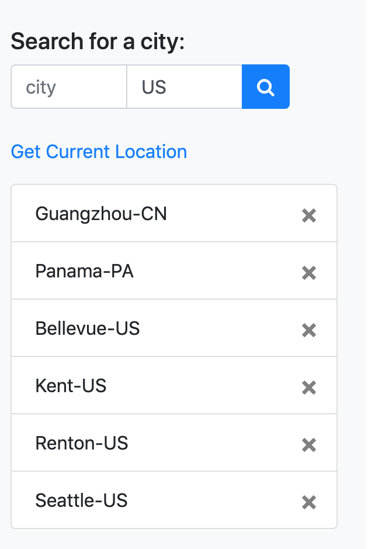
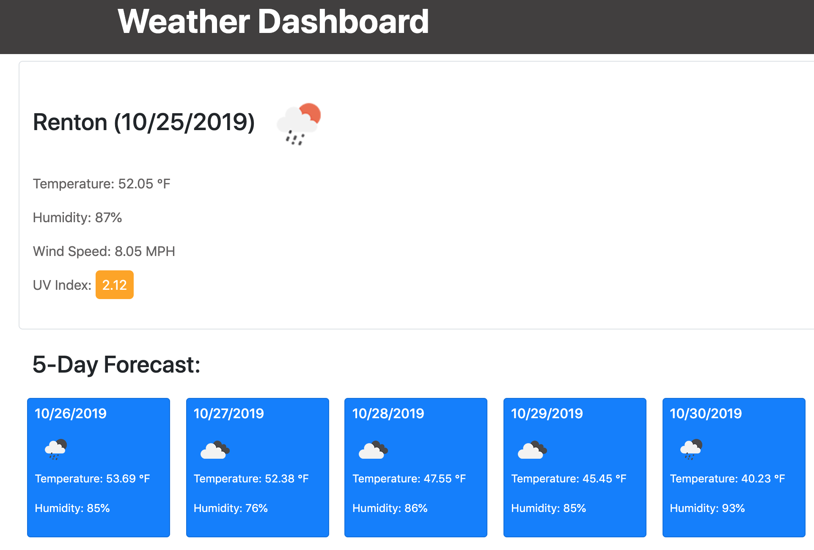
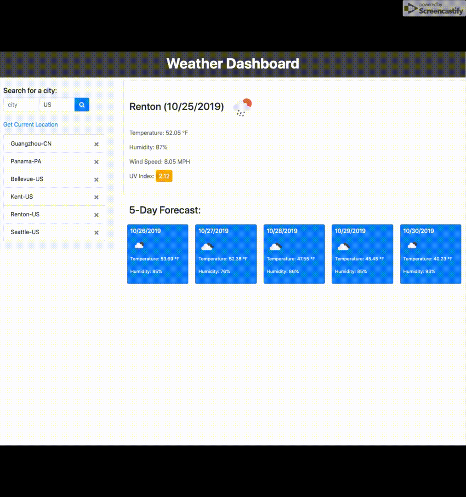
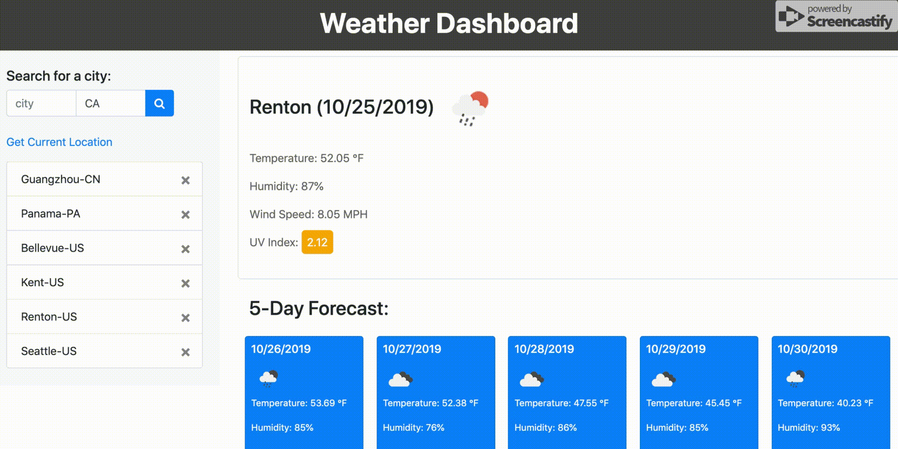
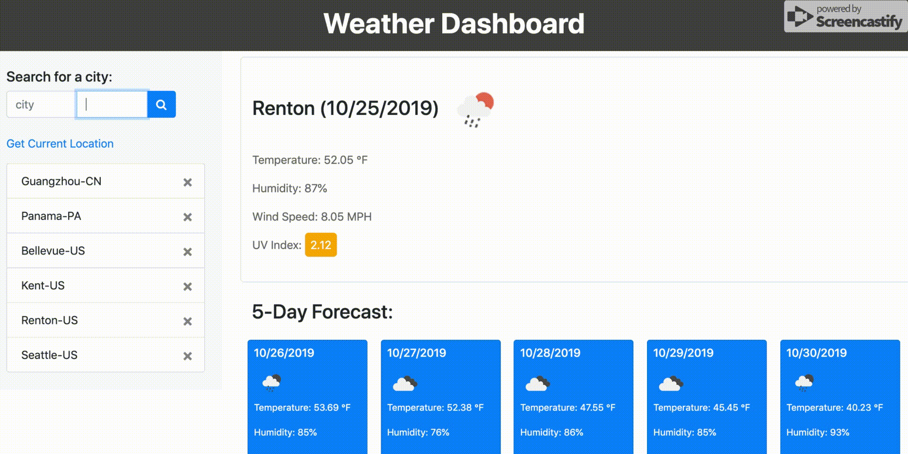

# Weather-Dashboard

## Description

As proceeing as a web developer, using another application's API and using it in the context of their own are the most commom tasks that web developer would be assigned. Third-party APIs allow us to access their data and functionality by making requests with specific parameters to a URL. In our daily life, weather dashborad is one of the tools that most of us mush use. In this application, I am going to use the OpenWeather API (https://openweathermap.org/api) to build a weather dashboard with below details:

* Left Column of Search Bar and List of History

* Right Column of Information Section with Current Data Weather and 5-day Weather Forecasts

In the process of building this calendar, I have learned:
* Utilize Github repository, familiarize git commands to save all my works onto github
* Familiarize the basic html commands to build the full contents of the site, especially have better understanding on div.
* Familiarize the styling commands on css, especially have better understanding on float, padding, margin, position
* Familiarize the bootstrap tags and utilize the documentations resourses on bootstrap website
* Realize using Bootstrap tags to build the main structure of the site is much more consice and easier
* Familiarize using jQuery to add more functional features along with html and css styling
* Using jQuery to add content to html more efficiently
* Familiarize using localStorage to persist data
* Adding customized comparator on sorting an array of object 
* Familiarize using media query to make my site to be responsive 

* First time to use close icon 
* Familiarilze using ajax to request data from Openweather.com via using APIs
* Using geolocation API to get current location data

* Adding JQuery Autocomplete feature to search country code when entering country name

## Credits 

I am here to acknowlage to the Coding Bootcamp of University of Washington along with below falcuties:
* Jason Rosen (Instructor)
* Daniel Mont-Eton (TA)
* Kris Shore (TA)
* devbridge/jQuery-Autocomplete (https://github.com/devbridge/jQuery-Autocomplete)

## License
MIT License

Copyright (c) [2019] [Norman Lei]

Permission is hereby granted, free of charge, to any person obtaining a copy
of this software and associated documentation files (the "Software"), to deal
in the Software without restriction, including without limitation the rights
to use, copy, modify, merge, publish, distribute, sublicense, and/or sell
copies of the Software, and to permit persons to whom the Software is
furnished to do so, subject to the following conditions:

The above copyright notice and this permission notice shall be included in all
copies or substantial portions of the Software.

THE SOFTWARE IS PROVIDED "AS IS", WITHOUT WARRANTY OF ANY KIND, EXPRESS OR
IMPLIED, INCLUDING BUT NOT LIMITED TO THE WARRANTIES OF MERCHANTABILITY,
FITNESS FOR A PARTICULAR PURPOSE AND NONINFRINGEMENT. IN NO EVENT SHALL THE
AUTHORS OR COPYRIGHT HOLDERS BE LIABLE FOR ANY CLAIM, DAMAGES OR OTHER
LIABILITY, WHETHER IN AN ACTION OF CONTRACT, TORT OR OTHERWISE, ARISING FROM,
OUT OF OR IN CONNECTION WITH THE SOFTWARE OR THE USE OR OTHER DEALINGS IN THE
SOFTWARE.

Ajax Autocomplete for jQuery is freely distributable under the terms of an MIT-style license.
Copyright notice and permission notice shall be included in all copies or substantial portions of the Software.